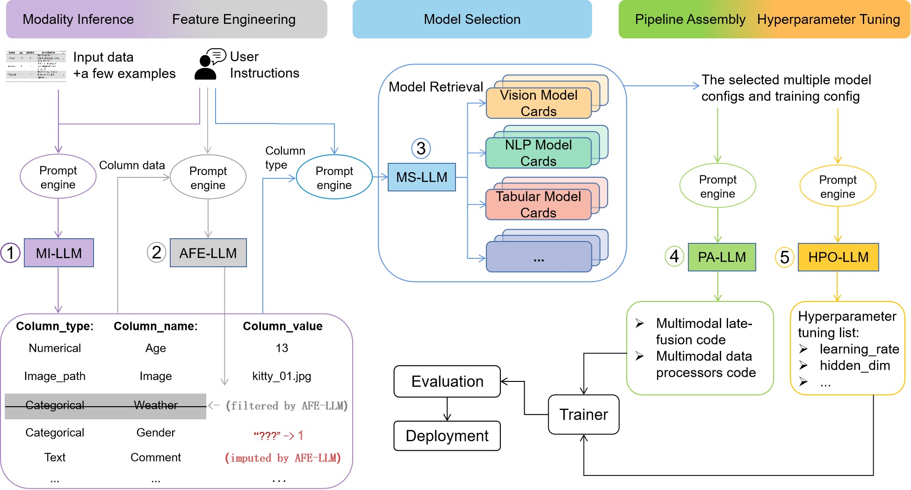

  
# AutoM3L: An Automated Multimodal Machine Learning Framework with Large Language Models (ACMMM2024)
[[Paper](https://arxiv.org/abs/2402.05937)]
<be>

## Introduction

In this work, we introduce AutoM3L, an LLM-powered Automated Multimodal Machine Learning framework. AutoM3L explores automated pipeline construction, automated feature engineering, and automated hyperparameter optimization. This enables the realization of an end-to-end multimodal AutoML framework. Leveraging the exceptional capabilities of LLMs, AutoM3L provides adaptable and accessible solutions for multimodal data tasks. It offers automation, interactivity, and user customization. Through extensive experiments and user studies, we demonstrate AutoM3L’s generality, effectiveness, and user-friendliness.

## Prerequisites
coming soon

## Train

## Citation

